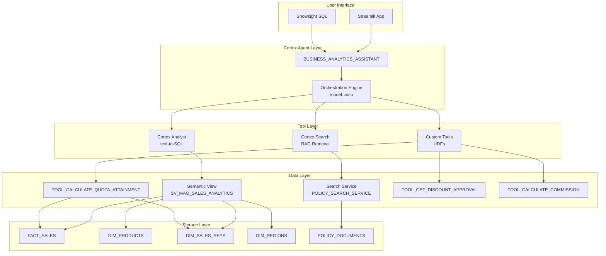
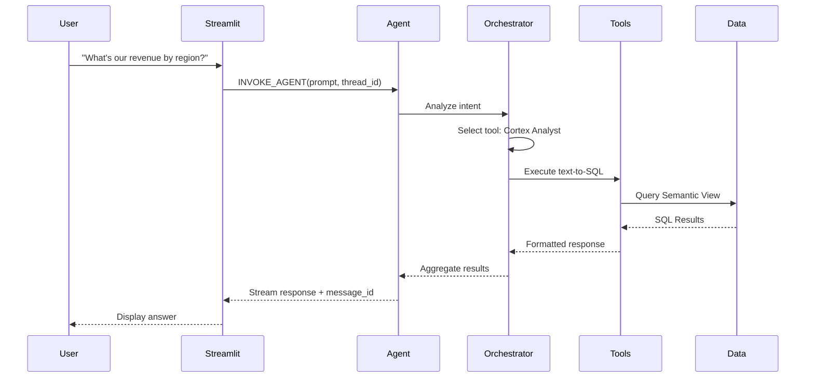
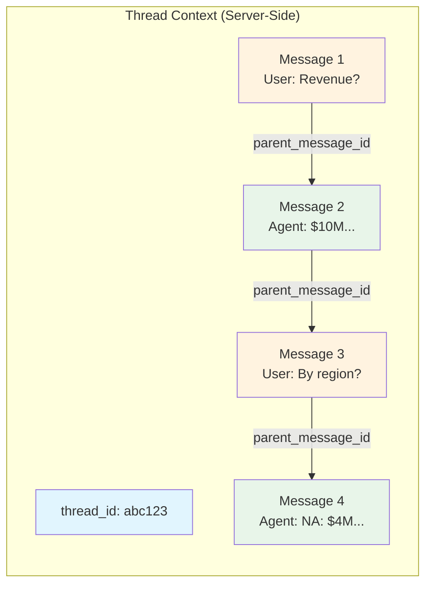
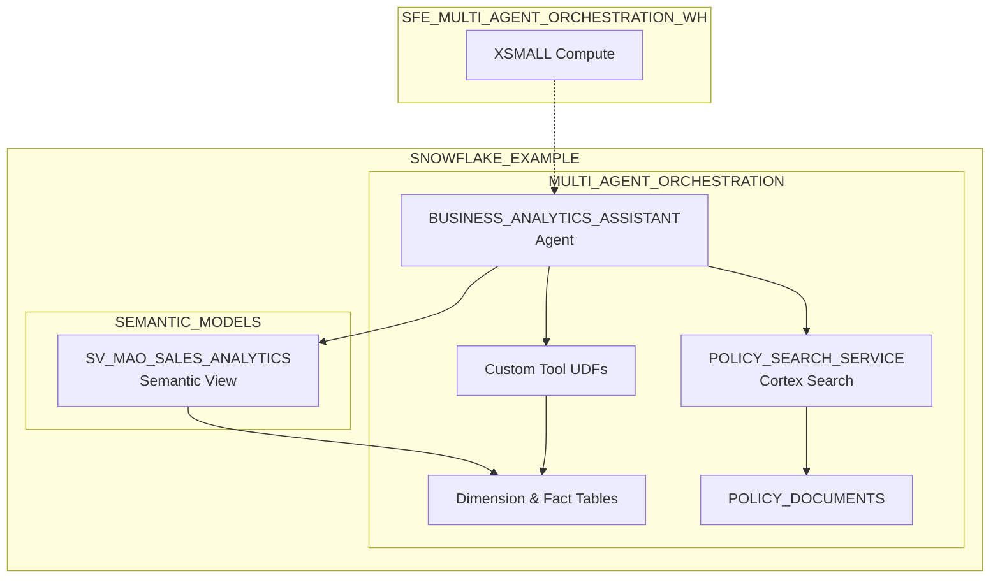
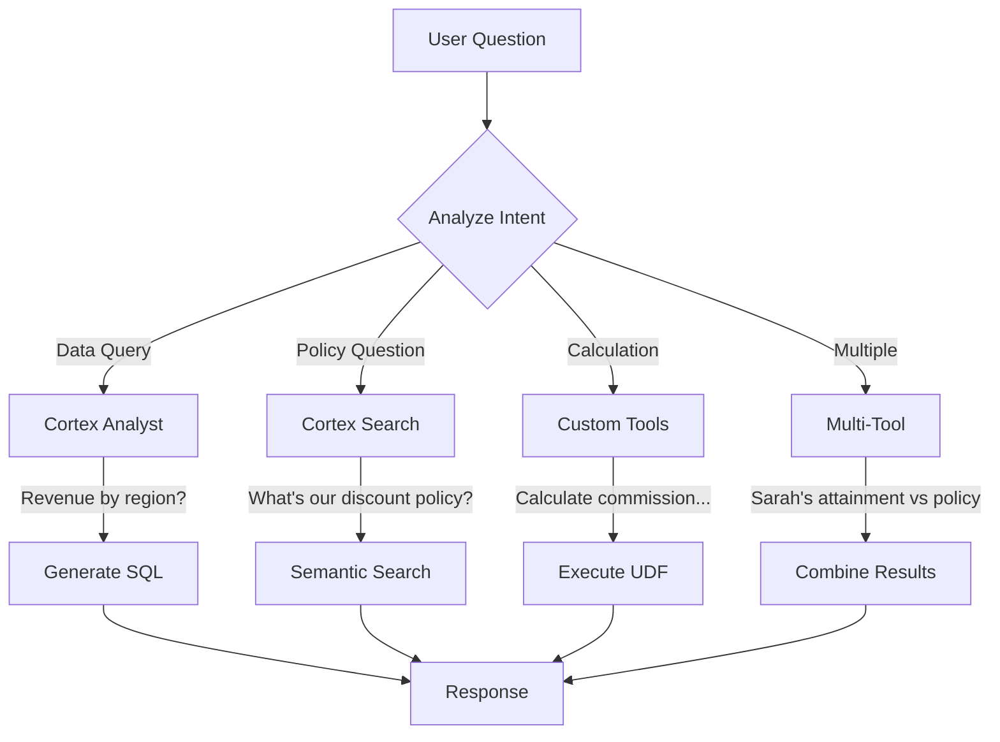

# Multi-Agent Orchestration - Architecture Diagrams

## Data Flow Diagram

```mermaid
flowchart TB
    subgraph User["User Interface"]
        UI[Streamlit App]
        SQL[Snowsight SQL]
    end

    subgraph Agent["Cortex Agent Layer"]
        BA[BUSINESS_ANALYTICS_ASSISTANT]
        ORCH[Orchestration Engine<br/>model: auto]
    end

    subgraph Tools["Tool Layer"]
        CA[Cortex Analyst<br/>text-to-SQL]
        CS[Cortex Search<br/>RAG Retrieval]
        CT[Custom Tools<br/>UDFs]
    end

    subgraph Data["Data Layer"]
        SV[Semantic View<br/>SV_MAO_SALES_ANALYTICS]
        CSS[Search Service<br/>POLICY_SEARCH_SERVICE]
        UDF1[TOOL_CALCULATE_QUOTA_ATTAINMENT]
        UDF2[TOOL_GET_DISCOUNT_APPROVAL]
        UDF3[TOOL_CALCULATE_COMMISSION]
    end

    subgraph Storage["Storage Layer"]
        FACT[FACT_SALES]
        DIM1[DIM_PRODUCTS]
        DIM2[DIM_SALES_REPS]
        DIM3[DIM_REGIONS]
        DOCS[POLICY_DOCUMENTS]
    end

    UI --> BA
    SQL --> BA
    BA --> ORCH
    ORCH --> CA
    ORCH --> CS
    ORCH --> CT
    CA --> SV
    CS --> CSS
    CT --> UDF1
    CT --> UDF2
    CT --> UDF3
    SV --> FACT
    SV --> DIM1
    SV --> DIM2
    SV --> DIM3
    CSS --> DOCS
    UDF1 --> FACT
    UDF1 --> DIM2
```

## Request Flow Sequence

```mermaid
sequenceDiagram
    participant U as User
    participant S as Streamlit
    participant A as Agent
    participant O as Orchestrator
    participant T as Tools
    participant D as Data

    U->>S: "What's our revenue by region?"
    S->>A: INVOKE_AGENT(prompt, thread_id)
    A->>O: Analyze intent
    O->>O: Select tool: Cortex Analyst
    O->>T: Execute text-to-SQL
    T->>D: Query Semantic View
    D-->>T: SQL Results
    T-->>O: Formatted response
    O-->>A: Aggregate results
    A-->>S: Stream response + message_id
    S-->>U: Display answer
```

## Threads API Context Flow

```mermaid
flowchart LR
    subgraph Thread["Thread Context (Server-Side)"]
        T1[thread_id: abc123]
        M1[Message 1<br/>User: Revenue?]
        M2[Message 2<br/>Agent: $10M...]
        M3[Message 3<br/>User: By region?]
        M4[Message 4<br/>Agent: NA: $4M...]
    end

    M1 -->|parent_message_id| M2
    M2 -->|parent_message_id| M3
    M3 -->|parent_message_id| M4

    style T1 fill:#e1f5fe
    style M1 fill:#fff3e0
    style M2 fill:#e8f5e9
    style M3 fill:#fff3e0
    style M4 fill:#e8f5e9
```

## Object Hierarchy

```mermaid
flowchart TB
    subgraph Database["SNOWFLAKE_EXAMPLE"]
        subgraph Schema1["MULTI_AGENT_ORCHESTRATION"]
            AGENT[BUSINESS_ANALYTICS_ASSISTANT<br/>Agent]
            SEARCH[POLICY_SEARCH_SERVICE<br/>Cortex Search]
            TOOLS[Custom Tool UDFs]
            TABLES[Dimension & Fact Tables]
            POLICIES[POLICY_DOCUMENTS]
        end
        
        subgraph Schema2["SEMANTIC_MODELS"]
            SEM[SV_MAO_SALES_ANALYTICS<br/>Semantic View]
        end
    end

    subgraph Warehouse["SFE_MULTI_AGENT_ORCHESTRATION_WH"]
        COMPUTE[XSMALL Compute]
    end

    AGENT --> SEARCH
    AGENT --> SEM
    AGENT --> TOOLS
    SEARCH --> POLICIES
    SEM --> TABLES
    TOOLS --> TABLES
    COMPUTE -.-> AGENT
```

## Tool Selection Logic

```mermaid
flowchart TB
    Q[User Question] --> ANALYZE{Analyze Intent}
    
    ANALYZE -->|Data Query| CA[Cortex Analyst]
    ANALYZE -->|Policy Question| CS[Cortex Search]
    ANALYZE -->|Calculation| CT[Custom Tools]
    ANALYZE -->|Multiple| MULTI[Multi-Tool]
    
    CA --> |"Revenue by region?"| SQL[Generate SQL]
    CS --> |"What's our discount policy?"| RAG[Semantic Search]
    CT --> |"Calculate commission..."| UDF[Execute UDF]
    MULTI --> |"Sarah's attainment vs policy"| BOTH[Combine Results]
    
    SQL --> R[Response]
    RAG --> R
    UDF --> R
    BOTH --> R
```
